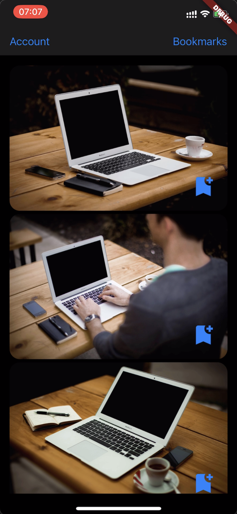
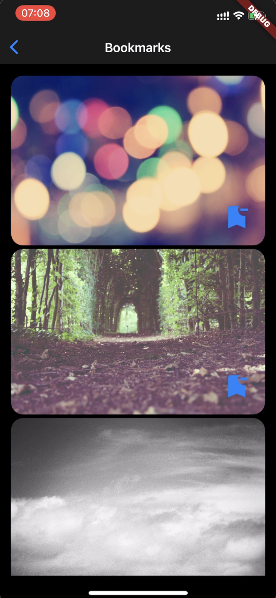
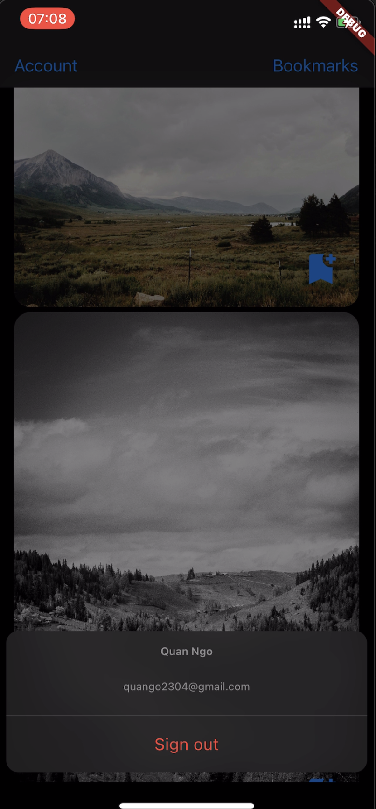

# Flutter Photo Gallery App

A beautiful and user-friendly photo gallery app built with Flutter. This app allows you to view photos from a public
API.

## Key Features

- Support for high-resolution photo viewing with infinite scroll
- Support google sign in
- Support save photos to bookmark, remove photos from bookmark (which is sync to firebase database)
- Dependencies injection for lose coupling so will easy to write unit tests

## Note

At this time, users can only view photos from the public API. Future updates will allow for photo uploads, photo sharing
and storage.
    
## Tech stacks:

- Flutter
- Firebase (database, authentication)

## Screenshots:

